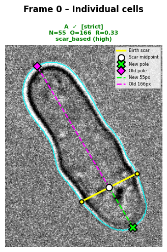
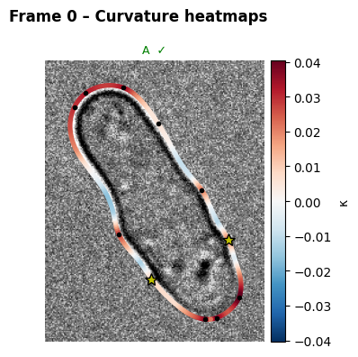
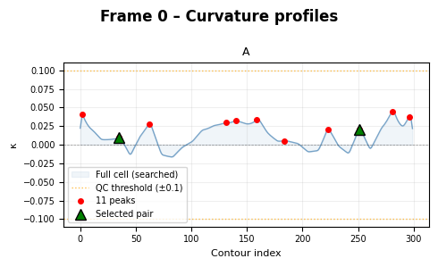
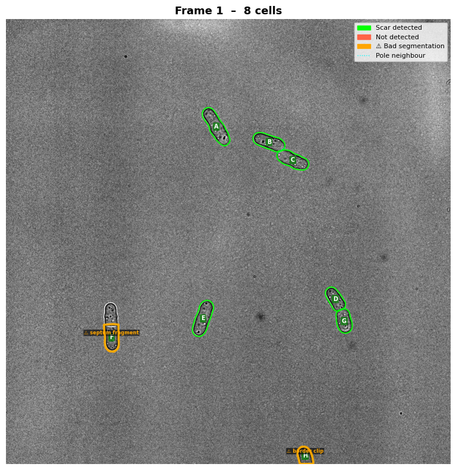

# BS-Detector
### Birth Scar Detector for *Schizosaccharomyces pombe*

Automated detection of birth scars, old/new pole identity, cell lineage tracking, and morphometric measurements in fission yeast time-lapse brightfield microscopy.



*Birth scar detection output. Yellow line: birth scar. Green marker: new pole. Magenta marker: old pole. Dashed lines: new-end and old-end compartment lengths.*

---

## What it does

*S. pombe* cells divide asymmetrically: each daughter inherits an **old pole** (present before the division) and one a **new pole** (the freshly formed division site). The division site leaves behind a **birth scar**: a subtle ridge of elevated curvature on opposite sides of the cell wall.

BS-Detector finds these scars automatically by:

1. **Segmenting** cells with [Cellpose](https://github.com/MouseLand/cellpose)
2. **Computing** a smoothed curvature profile along each cell's contour
3. **Finding** curvature peak pairs that satisfy two geometric constraints:
   - The pair must be on **opposite sides** of the cell
   - The vector connecting them must be **perpendicular** to the long axis (±`MAX_ANGLE_DEVIATION`°)
   - The pair must span **≥ `MIN_SCAR_WIDTH_RATIO`** of the cell's maximum width
4. **Identifying** new vs. old poles via scar location, neighbour proximity (cells touching tip-to-tip after division), or pole morphology as a fallback
5. **Tracking** cells across frames with a Hungarian algorithm that uses centre displacement, area change, and a curvature fingerprint
6. **Assigning lineage names**: `A → A0 / A1 → A00 / A01 / A10 / A11 → …`

### Curvature analysis

Signed curvature is computed along a smoothed B-spline contour. Birth scars appear as paired curvature peaks on opposite sides of the cell. The curvature heatmap and profile are available for every cell to aid manual inspection and parameter tuning.



*Curvature heatmap. Red regions indicate high positive curvature; blue regions indicate low or negative curvature.*



*Curvature profile. Red dots: detected peaks. Green triangles: the selected scar pair. Orange dotted lines: segmentation quality threshold.*

### Segmentation quality control

Cellpose occasionally produces artifact segmentations, most commonly a septum fragment (one half of a dividing cell) or a cell whose mask clips the image boundary. Both produce pathological curvature spikes well above the range of a healthy contour. BS-Detector flags these automatically with an orange overlay so they can be reviewed or excluded without disrupting the rest of the analysis.



*Orange outlines indicate cells flagged by the segmentation quality check. Green outlines are clean detections.*

---

## Output

For each frame and each cell, BS-Detector produces:

| Column | Description |
|---|---|
| `cell_name` | Lineage-encoded name (`A`, `A0`, `A01` …) |
| `frame` | Frame index |
| `length` | Pole-to-pole distance [px] |
| `width_centroid` | Width perpendicular to long axis at cell centre [px] |
| `width_scar` | Distance between the two scar endpoints [px] |
| `new_end_length` | Scar midpoint → new pole [px] |
| `old_end_length` | Scar midpoint → old pole [px] |
| `area` | Cell area [px²] |
| `scar_detected` | True / False |
| `seg_quality` | `ok`, `border_clip`, or `septum_fragment` |
| `pole_method` | How poles were assigned |
| `pole_confidence` | Confidence level of pole assignment |

---

## Installation & usage (Google Colab)

Open [`notebooks/BS_Detector_Colab.ipynb`](notebooks/BS_Detector_Colab.ipynb) in Colab.

**Step 1** — the first two cells install dependencies and clone this repo automatically.  
**Step 2** — edit the configuration cell (Step 3 in the notebook). That is the only cell most users ever need to change.  
**Step 3** — run the remaining cells top-to-bottom.

Your HDF5 data file and results folder live on Google Drive; the code is pulled from GitHub each session so you always have the latest version.

### Local installation

```bash
git clone https://github.com/widenerm/pombe-bs-detector.git
cd pombe-bs-detector
pip install -r requirements.txt
```

```python
from pombe_tracker.config   import Config
from pombe_tracker.pipeline import run_pipeline
from pombe_tracker.io_utils import load_h5_data, export_csv
from pombe_tracker.tracking import CellTracker

cfg    = Config()
cfg.H5_FILE_PATH = 'my_experiment.h5'
cfg.NUM_FRAMES   = 10

frames     = load_h5_data(cfg.H5_FILE_PATH, cfg.H5_DATASET_KEY)
tracker    = CellTracker(cfg)
results    = run_pipeline(frames, cfg, tracker=tracker)
export_csv(results, 'measurements.csv')
```

---

## Repository structure

```
pombe-bs-detector/
├── docs/
│   └── figs/              example figures
├── notebooks/
│   └── BS_Detector_Colab.ipynb   ← start here
├── pombe_tracker/
│   ├── config.py          central configuration (all tuneable parameters)
│   ├── geometry.py        curvature, PCA, width / length measurements
│   ├── detection.py       BirthScarDetector (orthogonality-based)
│   ├── poles.py           new/old pole assignment strategies
│   ├── segmentation.py    Cellpose wrapper
│   ├── tracking.py        Hungarian tracker + lineage naming
│   ├── pipeline.py        CellProcessor, frame loop, run_pipeline
│   ├── visualization.py   all plotting functions
│   ├── postprocessing.py  temporal scar stabilisation
│   └── io_utils.py        HDF5 loading, CSV export
├── requirements.txt
├── .gitignore
└── README.md
```

---

## Key parameters

| Parameter | Default | Effect |
|---|---|---|
| `SMOOTH_FACTOR` | 40.0 | B-spline smoothing; increase to reduce noise |
| `MIN_SCAR_WIDTH_RATIO` | 0.80 | Minimum scar width as fraction of cell width; increase to be stricter |
| `MAX_ANGLE_DEVIATION` | 20.0° | Max deviation from perpendicular; decrease to be stricter |
| `POLE_PROXIMITY_THRESHOLD` | 100 px | Max tip-to-tip distance to call two cells neighbours |
| `MAX_TRACKING_DISTANCE` | 80 px | Max centre displacement between frames |
| `CURVATURE_QUALITY_THRESHOLD` | 0.10 | Max curvature before a cell is flagged as a segmentation artefact |
| `SCAR_STABILITY_THRESHOLD` | 0.12 | Max scar position shift (normalised) before a frame is flagged |

All parameters are documented in [`pombe_tracker/config.py`](pombe_tracker/config.py).

---

## Citation

If you use BS-Detector in your research, please cite:

> [Your Name et al., *Journal*, Year. BS-Detector: Automated birth scar detection and lineage tracking in *S. pombe*.]

---

## License

MIT
